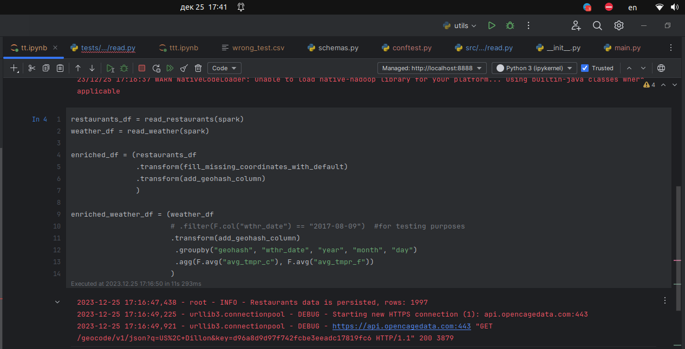
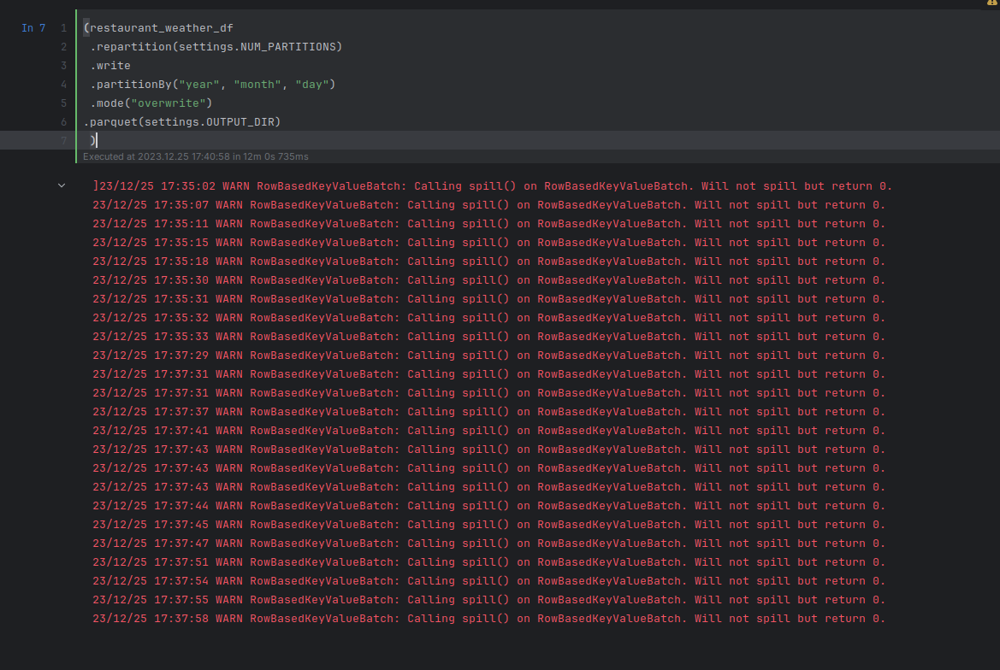

# Restaurants data enrichment with weather data

Takes as inputs paths to directories with restaurants and weather data. 
Produces a dataset with restaurants data enriched with weather data, which stores in parquet format with partitions. 
Both inputs and output stored on the local file system.
Processing is done via Spark installed on the local machine.

## Prerequisites
### Input data
- Restaurants data in CSV format with the header and corresponding to the schema in `src/load/schemas.py:4` .
- Weather data in parquet format corresponding to the schema in `src/load/schemas.py:17`.

For weather data to transform from weather.zip to the data in the required format, use the `src/utils.py` script.

 ### Environment 
Run on the local machine with the installed Spark. Use Python 3.11.^ . 

Create virtual environment and install dependencies with:
```bash
make create-env
```

Required env variables:
    
    STUDY_SPARK_OPENCAGE_API_KEY - OpenCage API key
    (or can be placed in src/config/.secrets.toml file like so "OPENCAGE_API_KEY = 'your_key'")

Optional env variables (see defaults in src/config/settings.toml):
    
    STUDY_SPARK_RESTAURANTS_DIR - path to the source restaurants data
    STUDY_SPARK_WEATHER_DIR - path to the source weather data
    STUDY_SPARK_OUTPUT_DIR - path to the output directory
    NUM_PARTITIONS - how many cores you have on your machine

Internet connection is required to access the OpenCage Geocoding API.

## Output
The output is a dataset with restaurants data enriched with weather data, 
which stores in parquet format with partitions by year/month/day.

## To run the application:
```bash
venv/bin/poetry run python src/main.py
```

## Tests
```bash
venv/bin/poetry run pytest
```


## Screenshots
As you can see from the screenshots, the application (the action) works for 12 minutes.


